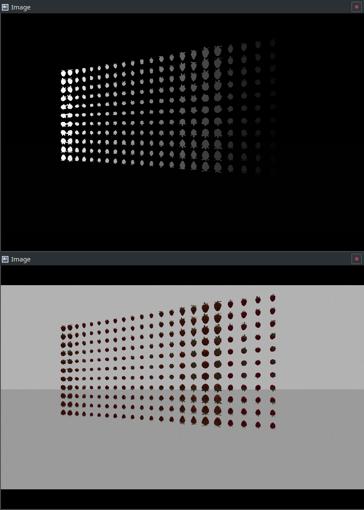

# Gazebo camera segmentation plugin

This is a segmentation plugin for gazebo cameras.
It employs a gazebo color-. depth- and logical-camera to create segmentation maps for camera images and publishes them to ROS.

In the example shown above, the bottom image is the image created by a gazebo color camera, the top image shows the corresponding segmentation map created by this plugin.

Since this plugin is CPU based for the moment (due to OpenGL shaders not having access to Ogre Object IDs, and therefore being no easy way to utilize GPU capabilities), it can be rather slow. Depending on the complexity of the scene, rendering a segmentation map can take several seconds (up to minutes for really complex geometries).

The plugin, however, employs multithreading to utilize all available CPU threads.

As a further performance boost, a segmentation map is only created for pixels with valid depth information. You can control this by setting the 'near' and 'far' clipping parameters of the depth camera employed by the plugin.